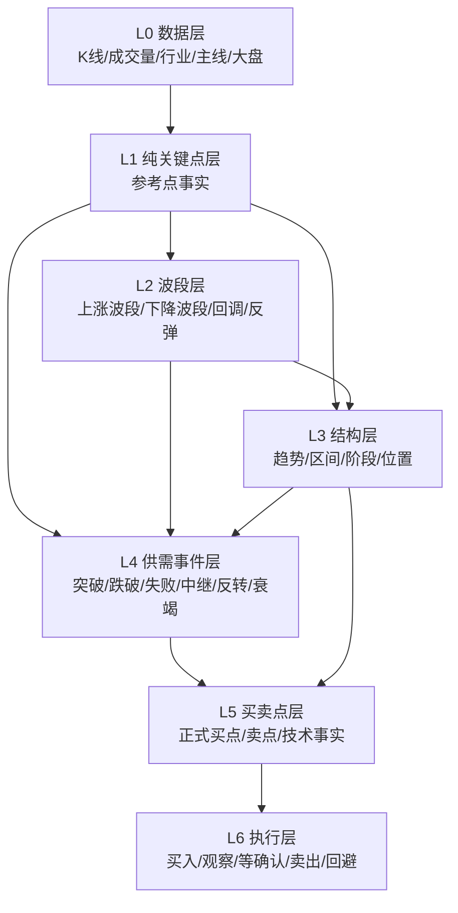

# 3L 算法全链路设计：关键点 → 结构 → 供需 → 买卖点

> 状态：设计稿 v0.1  
> 目标：把 3L 原文中的交易程序，落成可测试、可回归、可展示的工程管线。  
> 范围：大盘、板块、个股共用同一套语义分层；不同资产只允许参数不同，不允许概念混用。

## 1. 设计背景

最近修复 #215-#222 之后，系统已经解决了一批前端语义矛盾：

- 最终 `sell/hold` 不再暴露正式 `buy_point`；
- 技术层识别到的事实保留为 `technical_buy_point`；
- 正式 `buy_point` 必须通过供需事件校验；
- 复盘买点列表不再复用旧缓存卡片绕过当前门禁；
- 上涨趋势回调里的缩量/地量中继，可以识别为 `bullish_continuation` 供需事件。

但这些仍然是局部收口。系统还缺一份全局契约，明确：

- 什么是“事实”，什么是“解释”，什么是“交易指令”；
- 关键点、波段、结构、供需事件、买卖点之间如何依赖；
- 哪些字段可以进入复盘页正式买点列表，哪些只能进入观察/候选列表；
- 当前代码哪些可复用，哪些需要重构。

## 2. 3L 原文约束

### 2.1 看盘顺序

知识库中《走势结构与阶段》《强弱结构判断及买卖点匹配》反复强调：

1. 先判断市场强弱；
2. 再判断走势结构和所处阶段；
3. 最后才看量价行为和买卖点。

也就是：

```text
市场环境 → 结构/阶段 → 量价行为 → 买卖点/卖点 → 操作计划
```

不能反过来用单日技术信号替代结构判断，也不能用“区间底部/区间顶部”直接替代买卖点。

### 2.2 关键点分类

知识库把关键点分成两类。

第一类是“明显参考点”：

- 前高 / 区间顶部；
- 前低 / 区间底部；
- 天量 K 线高低点；
- 地量 K 线高低点；
- 明显长阳、长阴、十字星、长上影、长下影等特殊 K 线。

这类点来自锚定效应，只描述市场容易共同关注的位置。

第二类是“供需格局转换点”：

- 突破点：趋势形成点；
- 反转点：趋势逆转点；
- 中继点：趋势延续点。

原文强调：突破点和反转点通常伴随放量，因为需要更大的力量改变原供需格局；中继点通常伴随缩量，因为力量小，无法改变原趋势。

### 2.3 结构和阶段

结构只有三大类：

- 上升趋势：需求占优，做多容错率高，加速除外；
- 下降趋势：供应占优，做多失败率高，恐慌/反转除外；
- 区间震荡：供需均衡，只关注两头。

阶段是结构内部的生命周期：

- 上升趋势：形成、发展、加速、逆转；
- 下降趋势：形成、发展、恐慌、逆转；
- 区间震荡：重点不是阶段，而是区间上沿/下沿/中部位置。

### 2.4 四类买点

| 买点 | 原文语义 | 必要上下文 | 典型证据 |
| --- | --- | --- | --- |
| 突破买点 | 放量突破平台，需求打破供应 | 强势市场、趋势性市场、区间突破、强个股 | 关键压力位附近放量上涨并站上 |
| 中继买点 | 顺大势逆小势，上升趋势中缩量/地量回踩 | 上升趋势、突破回踩、区间底部不破 | 回踩关键位、缩量/地量、供应不足 |
| 反转买点 | 下降/调整末端需求压倒供应 | 弱势末端、下降趋势逆转、区间底部跌破失败 | 放量反包、长下影、跌破失败、需求进入 |
| 恐慌买点 | 低位天量滞跌，供应一致出清 | 弱势市场、下降趋势末端、区间底部 | 天量滞跌，后续仍需需求确认 |

### 2.5 卖点/风险点

对应的风险事件包括：

- 区间顶部突破失败；
- 高位放量滞涨 / 高潮滞涨；
- 向下跌破；
- 上升趋势强转弱；
- 下降趋势中无量反弹 / 下跌中继；
- 主跌风险。

## 3. 分层契约

整个算法必须拆成六层。上层可以消费下层，不能反向污染下层。



### L0 数据层

职责：

- 提供复权一致、顺序一致、字段一致的 K 线；
- 标记数据时效：confirmed / estimated / stale；
- 标记资产类型：market / sector / concept / stock。

不允许：

- 在数据层推导买卖点；
- 混用不同数据源后不标注来源。

当前代码：

- `backend.data_access.data_layer`
- 数据源分层设计文档：`docs/data-source-*`

### L1 纯关键点层

职责：只识别图上事实，不解释交易含义。

输出类型：

- `price_high` / `price_low`：局部高低点；
- `prior_high` / `prior_low`：前高前低；
- `volume_peak` / `volume_trough`：局部量峰/量谷；
- `huge_volume` / `dry_volume`：天量/地量候选；
- `wide_up_bar` / `wide_down_bar`：长阳/长阴；
- `long_upper_shadow` / `long_lower_shadow`；
- `gap` / `limit_up` / `limit_down` 等扩展事实。

关键原则：

- 最新一天只允许 `candidate`，不能伪装成 confirmed；
- 天量/地量应优先用局部窗口和分位数，不宜仅用固定均线倍数；
- 对大盘、板块、个股允许参数不同，但输出字段必须一致。

当前代码：

- `backend.core.pure_keypoint_detector.detect_pure_keypoints`
- 验证脚本：`server/scripts/render_pure_keypoint_validation.py`
- 基准摘要脚本：`server/scripts/summarize_pure_keypoint_benchmark.py`
- 人工确认基准：
  - `server/backend/tests/fixtures/pure_keypoint_benchmark_v1.json`
  - `server/backend/tests/fixtures/pure_keypoint_benchmark_v2.json`

当前基准覆盖：

| 版本 | 样本 | 点位 | 资产类型 | 说明 |
| --- | ---: | ---: | --- | --- |
| v1 | 8 | 133 | market=2 / sector=3 / stock=3 | 科创50、中证全指、CPO、元件、存储、中国巨石、太辰光、普冉股份 |
| v2 | 25 | 435 | market=2 / sector=14 / stock=9 | 扩展指数、板块/概念和 qfq 个股样本；排除工业富联、新易盛、寒武纪三个异常复权断层样本 |

合计已锁定 33 个样本、568 个纯关键点，其中 confirmed=493、
candidate=75。当前 fixture 只锁定客观事实点：`price_high`、
`price_low`、`volume_peak`、`volume_trough`，不表达买卖含义。

需要继续改进：

- 继续扩大人工验证基准集；
- 明确天量/地量的窗口参数；
- 对最新一天候选点增加“可能延续”的状态说明。

### L2 波段层

职责：把连续走势拆成可解释的运动段。

输出类型：

- `impulse_up`：上涨推动波；
- `pullback_down`：上涨趋势中的回调波；
- `impulse_down`：下跌推动波；
- `countertrend_bounce`：下降趋势中的反弹波；
- `range_swing_up` / `range_swing_down`：区间内部上下摆动；
- `candidate_reversal`：候选转折段。

关键原则：

- 波段不是交易指令；
- 回调波段不是下降趋势；
- 下降趋势反弹不是上涨趋势；
- 最新波段可为 active/candidate，不强行确认。

当前代码：

- `backend.core.wave_structure_detector.judge_wave_structure`
- 验证脚本：`server/scripts/render_wave_structure_validation.py`
- 基准摘要脚本：`server/scripts/summarize_wave_structure_benchmark.py`
- 离线基准：`server/backend/tests/fixtures/wave_structure_benchmark_v1.json`
- 真实行情回归基准：`server/backend/tests/fixtures/wave_structure_benchmark_v2.json`

当前 v1 离线基准覆盖 6 个 3L 波段语义场景：

| 场景 | 目标 |
| --- | --- |
| 先跌后强反弹 | 较 EMA 滞后更早识别上涨波段 |
| 主跌后反弹 | 保持下降趋势，只把当前交易波段标为反弹 |
| 无主导波段 | 保持区间震荡 |
| 上涨趋势中回调 | 主结构仍上涨，但交易波段暴露为下降/回调 |
| 个股候选反向波 | confirmed pivot 未翻空前，交易波段先暴露候选下降波 |
| 深下影收回 | 不仅因影线把交易波段翻成下降 |

当前 v2 真实行情回归基准引用已固化的 `pure_keypoint_benchmark`
行情 rows，覆盖 15 个样本：

| 类型 | 样本 |
| --- | --- |
| 大盘 | 科创50、中证全指 |
| 板块 | CPO、元件、存储 |
| 个股 | 中国巨石、太辰光、普冉股份、圣邦股份、美年健康、永鼎股份、绿的谐波、长川科技、中际旭创、胜宏科技 |

v2 的用途是锁定 `wave-structure-v1` 当前结构/阶段/交易波段输出，
方便后续算法改动时发现漂移；它不表达买卖点，也不代表每个样本已经完成
最终人工定稿。若人工复核发现某样本语义不符合 3L，应先修算法或调整
expected，并保留变更说明。

需要继续改进：

- 进一步区分“趋势内回调”和“结构反转”；
- 对 v2 真实行情样本做逐样本人工复核，特别关注上涨趋势中回调与结构反转的边界；
- 对多日供需转换区间增加 `candidate_reversal` / `transition_zone` 标注。

### L3 结构层

职责：基于关键点和波段，判断当前资产处于什么结构和阶段。

输出字段：

```json
{
  "structure": "上涨趋势|下降趋势|区间震荡|未识别",
  "stage": "形成|发展|加速|逆转|区间顶部|区间底部|区间中段|回调|反弹|主跌|恐慌",
  "confidence": 0,
  "position_context": {},
  "major_decline_risk": {},
  "is_trade_decision": false
}
```

关键原则：

- 结构层只给背景和概率优势，不直接给买卖点；
- 区间顶部不是突破买点，可能是卖点/风险点；
- 区间底部不是自动买点，只是支撑/观察位置；
- 下降趋势中的缩量不能解释为中继买点，除非先出现恐慌或清晰反转。

当前代码：

- `backend.core.structure_context_detector.detect_3l_structure_context`
- `backend.core.structure_position_context.detect_structure_position_context`
- 验证脚本：`server/scripts/render_structure_context_validation.py`

需要继续改进：

- 减少上涨段被误判成区间震荡；
- 明确“未识别”的降级策略；
- 将结构判断和复盘页三大信息（市场环境、风险阶段、波段位置）统一口径。

### L4 供需事件层

职责：把关键点 + 波段 + 结构组合成供需语义事件。

事件类型：

| subtype | 中文 | 方向 | 语义 |
| --- | --- | --- | --- |
| `upward_breakout` | 向上突破 | bullish | 需求打破供应区 |
| `downward_breakdown` | 向下跌破 | bearish | 供应打破需求区 |
| `failed_breakout` | 突破失败 | bearish | 需求进攻失败，供应重新占优 |
| `failed_breakdown` | 跌破失败 | bullish | 供应打压失败，需求承接 |
| `bullish_continuation` | 上涨中继 | bullish | 回调无法改变需求占优格局 |
| `bearish_continuation` | 下跌中继 | bearish | 反弹无法改变供应占优格局 |
| `bullish_reversal` | 向上反转 | bullish | 需求重新压倒供应 |
| `bearish_reversal` | 向下反转 | bearish | 供应重新压倒需求 |
| `panic_stagnation` | 恐慌滞跌 | bullish | 低位天量滞跌，供应衰竭 |
| `climax_stagnation` | 高潮滞涨 | bearish | 高位天量滞涨，需求衰竭 |

关键原则：

- 供需事件仍不是交易指令；
- `trade_implication` 只能说 candidate/avoid/risk context；
- 事件必须暴露 `definition_aligned` 和 `semantic_warnings`；
- 事件分层 `core/watch/weak` 只用于排序和展示，不等于胜率。

当前代码：

- `backend.core.supply_demand_keypoint_detector.detect_supply_demand_keypoints`
- `backend.core.supply_demand_event_detector.detect_supply_demand_events`
- 验证脚本：
  - `server/scripts/render_supply_demand_keypoint_validation.py`
  - `server/scripts/render_supply_demand_event_validation.py`

已完成的近期修正：

- 上涨趋势回调中的下降小波段不再自动排除中继；
- `dry_volume` 可作为上涨中继的无供应证据；
- 上涨趋势回调中的中继事件优先级不再被错误扣成 weak。

需要继续改进：

- 反转事件的定义仍较粗；
- 突破失败/跌破失败需要更多历史样本验证；
- 事件冲突解决目前只取单个最高优先级点，可能遗漏多事件上下文。

### L5 买卖点层

职责：把结构和供需事件转换为候选买卖点或正式买卖点。

字段约定：

| 字段 | 含义 |
| --- | --- |
| `technical_buy_point` | 技术层识别到的买点事实，允许在 hold/sell 中存在 |
| `buy_point` | 正式买点，只允许在 `signal=buy` 时存在 |
| `signal` | 最终执行信号：buy/hold/sell |
| `technical_signal` | 技术事实方向：buy/hold/sell |
| `supply_demand_alignment` | 正式买点是否有供需事件支撑 |

正式买点门禁：

| buy_point | 必须匹配的供需事件 |
| --- | --- |
| 突破买点 | `upward_breakout` |
| 中继买点 | `bullish_continuation` |
| 反转买点 | `bullish_reversal` 或 `failed_breakdown` |
| 恐慌买点 | `panic_stagnation` |

卖点/风险门禁：

- `failed_breakout`、`climax_stagnation`、`downward_breakdown` 等 bearish core/watch 事件，应阻断正式买入；
- 最终 `signal != buy` 时，必须清空正式 `buy_point` 和买点型 `stop_loss`；
- 技术事实必须转入 `technical_buy_point`，供用户理解“为什么曾经被关注”。

当前代码：

- `core/threel_core/buy_point_detection.py`
- `backend.core.signal_detector.fusion.fusion_judge`
- `backend.services.stock_card_service.get_stock_card`

需要继续改进：

- 旧 `detect_buy_point` 仍有较多历史规则，需要逐步改造成消费 L4 事件；
- `fusion_judge` 应从“直接推买卖”降级为“技术事实融合”，由 L5 门禁决定正式买卖点；
- 反转买点和恐慌买点需要单独回测。

### L6 执行层

职责：给复盘页/个股卡/工作台生成可执行语言。

执行动作：

- `买入`
- `观察`
- `等确认`
- `持有`
- `减仓`
- `卖出`
- `回避`

关键原则：

- 执行动作必须基于正式 `signal`；
- `技术信号` 不能显示成可执行买入；
- 复盘正式买点列表只展示 `signal=buy && buy_point != ''`；
- 被降级的技术事实应进入“技术候选/观察信号”区域，而不是混在正式买点里。

当前代码：

- `backend.services.stock_card_service.build_trade_decision`
- `backend.core.review_analysis.generate_buy_signals_review`
- `backend.core.review_analysis.generate_technical_candidates_review`
- `backend.services.review_compute_service.apply_trading_plan_actions`
- 复盘页“技术候选/观察信号”区域：PR #224 已上线。

需要继续改进：

- 工作台计划只消费正式 buy/sell，不消费 technical-only；
- 每条计划要变成条件计划，而不是名词结论。

## 4. 当前代码映射

| 3L 层级 | 当前核心实现 | 当前状态 |
| --- | --- | --- |
| L1 纯关键点 | `pure_keypoint_detector.py` | 已有实现；v1/v2 人工确认基准已固化，需继续扩大样本 |
| L2 波段 | `wave_structure_detector.py` | 已有实现；v1 离线语义基准与 v2 真实行情回归基准已固化，需继续人工复核边界样本 |
| L3 结构 | `structure_context_detector.py` | 已接入卡片，需继续回归 |
| L4 供需事件 | `supply_demand_keypoint_detector.py` / `supply_demand_event_detector.py` | 已接入卡片，近期已修中继 |
| L5 买卖点 | `buy_point_detection.py` / `fusion.py` / `stock_card_service.py` | 门禁已初步收口，旧逻辑仍需改造 |
| L6 执行 | `build_trade_decision` / review services | 正式买点列表与技术候选列表已分离；计划层条件化待做 |

## 5. 数据契约

### 5.1 事实层对象

```json
{
  "type": "volume_peak",
  "idx": 120,
  "date": "20260911",
  "price": 123.45,
  "status": "candidate|confirmed",
  "asset_type": "stock",
  "evidence": {},
  "is_trade_decision": false
}
```

### 5.2 供需事件对象

```json
{
  "subtype": "bullish_continuation",
  "event_label": "上涨中继",
  "direction": "bullish",
  "tier": "watch",
  "definition_aligned": true,
  "semantic_warnings": [],
  "structure_context": {},
  "position_context": {},
  "wave_context": {},
  "volume_price_evidence": {},
  "trade_implication": "candidate_continuation_context",
  "is_trade_decision": false
}
```

### 5.3 买卖点对象

```json
{
  "technical_signal": "buy",
  "technical_buy_point": "中继买点",
  "signal": "buy",
  "buy_point": "中继买点",
  "supply_demand_alignment": {
    "status": "matched",
    "expected_subtypes": ["bullish_continuation"],
    "matched_subtypes": ["bullish_continuation"]
  },
  "decision": {
    "action": "买入",
    "signal": "买点",
    "reason": "上涨趋势·回调"
  }
}
```

## 6. 页面展示原则

### 6.1 复盘页

复盘页应分成五块：

1. 市场环境：强弱、主跌风险、波段位置；
2. 主线/动量候选：L1/L2 动量，不误称“最强逻辑”；
3. 板块供需阶段：板块结构、阶段、供需事件；
4. 正式买点：只展示 `signal=buy && buy_point != ''`；
5. 技术候选/观察信号：展示 `technical_buy_point != '' && buy_point == ''`。

### 6.2 个股卡

个股卡应明确区分：

- 技术事实：`technical_buy_point`、触发信号、供需事件；
- 正式结论：`signal`、`buy_point`、`decision`；
- 风险解释：bearish events、主跌风险、结构冲突。

### 6.3 工作台

工作台只接受正式动作：

- 买入计划：来自正式 `signal=buy`；
- 卖出/减仓计划：来自正式 `signal=sell` 或风险计划；
- 观察计划：来自 technical-only，但必须写成条件计划。

## 7. 后续 PR 拆分

### PR-A：本文档

目标：固定 3L 算法分层和字段语义。

验收：

- 文档合并；
- 后续 PR 均引用本契约。

### PR-B：新增技术候选/观察信号列表

状态：已完成并上线（PR #224）。

目标：解决 #222 后正式买点列表可能为空，但技术候选被完全过滤的问题。

内容：

- review API 增加 `technical_candidates_review`；
- 展示 `technical_buy_point`、结构原因、供需缺口、需要确认的条件；
- 不进入正式交易计划。

### PR-C：L1 关键点 fixture 基准

状态：核心基准已完成；本阶段继续补充摘要和维护契约。

目标：固化人工已确认样本。

样本：

- 科创50；
- 中证全指；
- CPO、元件、存储；
- 中国巨石、太辰光、普冉股份；
- v2 扩展至创业板指、上证指数、机器人、人形机器人、半导体、汽车零部件、创新药、医疗服务、通信设备、消费电子、算力租赁、人工智能、贵金属、煤炭开采加工、证券、房地产、拓普集团、圣邦股份、美年健康、永鼎股份、绿的谐波、长川科技、中际旭创、北方华创、胜宏科技。

排除：

- 工业富联、新易盛、寒武纪因前复权后仍有异常价格断层，不进入 benchmark。

### PR-D：L2/L3 波段结构 fixture 基准

状态：v1 离线语义基准与 v2 真实行情回归基准已完成；真实行情样本仍需逐样本人工复核。

目标：结构识别不再只靠局部 EMA/阶段标签。

内容：

- 保存人工校验波段；
- 增加趋势内回调、下降趋势反弹、区间摆动测试。

### PR-E：L4 供需事件回归扩展

目标：每类事件至少 3 个正例、3 个反例。

优先：

- `failed_breakout`
- `failed_breakdown`
- `bullish_reversal`
- `panic_stagnation`
- `climax_stagnation`

### PR-F：买卖点引擎重构

目标：`detect_buy_point` 改为消费 L4 供需事件，而不是独立重复判断。

关键约束：

- 买点函数不能直接绕过结构；
- fusion 只产出技术事实；
- stock card 最终统一门禁。

### PR-G：计划层条件化

目标：复盘页/工作台输出条件计划。

例：

```text
如果明日站回 20 日线且量能不放大下跌，则观察转为中继确认；
如果跌破本轮回调低点，则中继候选失效。
```

## 8. 验收总标准

任一版本上线前，至少满足：

1. `signal != buy` 时，正式 `buy_point` 必须为空；
2. `signal=buy` 且 `buy_point` 非空时，供需校验必须 `matched` 或有明确白名单说明；
3. bearish core/watch 事件不能同时给正式买入；
4. 复盘正式买点、技术候选、持仓风险三类列表不能混用；
5. 每一层输出都包含 `is_trade_decision`，事实层和供需层必须为 false；
6. 最新一天所有未确认关键点/波段必须标记 candidate；
7. 每次算法变更必须有样本回归图或 fixture 测试。
