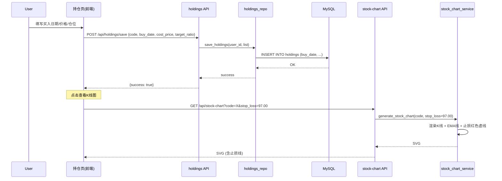

# 持仓股ATR止损与买入日期 — 设计文档 v1

## 1. 背景与问题

### 现状

当前止损计算 (`calc_stop_loss`) 支持两种模式：

| 模式 | 条件 | 公式 | 3L原文依据 |
|:----|:-----|:-----|:----------|
| 3L买点止损 | 有 buy_type + entry_idx | entry_kline_low × 0.97 | ✅ 中继买点跌破低吸点 / 突破买点跌破突破位置 |
| 无买点兜底 | 支撑位或 EMA20 | support × 0.97 或 EMA20 × 0.97 | ⚠️ 无原文依据，编程近似 |

### 痛点

1. **持仓股无3L买点记录** — 用户在持仓页手动买入的股票没有 entry_idx（买入K线位置），只能用支撑位/EMA20兜底。支撑位可能过远（-12%+），EMA20可能太近（被正常波动触发）
2. **无买入日期** — `holdings` 表有 `cost_price`（买入价）但没有 `buy_date`，无法确定买入当天的K线位置
3. **仓位比例丢失** — 之前测试覆盖写坏了数据，持仓的 `target_ratio` 全为 0
4. **止损无可视化** — K线图上没有止损线，用户不知道止损在哪

### 目标

- 持仓页增加**买入日期**录入，保存到 DB
- 非3L买入的持仓股用 **2×ATR(14)** 计算动态止损
- K线图上画出止损水平线
- 仓位比例恢复可编辑

## 2. 设计思想

### 2.1 核心理念

**非3L买点的止损需要波动率自适应。**

- 3L买点有明确的 entry_kline，止损参考该K线的最低价 × 0.97
- 非3L买入没有参考K线，但股价的合理波动范围可以用 ATR 度量
- 2×ATR 意味着「允许股价在正常波动范围内运行，超出则止损」
- 高波动股票（ATR大）止损宽，低波动股票（ATR小）止损紧 — 自适应

### 2.2 方案选择

| 方案 | 优点 | 缺点 | 结论 |
|:----|:----|:-----|:----:|
| **2×ATR(14)** 低于买入价 | 自适应波动率，3L框架外合理补充 | ATR对跳空不敏感 | ✅ 主方案 |
| 固定百分比（-5% / -7%） | 简单 | 高波动股易被触发，低波动股止损太宽 | ❌ 不自适应 |
| 支撑位 × 0.97（现状） | 3L体系内 | 支撑可能太远或已过时 | ❌ 保留作兜底 |

### 2.3 设计原则

1. **3L买点优先** — 有买点类型的持仓沿用现有 entry_kline_low × 0.97 逻辑
2. **ATR补充非3L场景** — 无买点时用 ATR，支撑位/EMA20 作兜底
3. **数据由用户录入** — 买入日期/价格由用户在持仓页填写，系统不猜测
4. **止损可见** — 持仓股K线图上画止损线

### 2.4 屏幕内外

- **做什么：**
  - holdings 表加 `buy_date` 字段
  - 持仓页编辑弹窗加「买入日期」输入框
  - `calc_stop_loss` 支持 ATR 模式
  - K线图传 `stop_loss` 参数画止损线
  - 仓位比例恢复可编辑

- **不做什么：**
  - 不自动推算买入日期（由用户明确输入）
  - 不修改3L买点的止损逻辑（entry_kline_low × 0.97 保持不变）
  - 不处理指数/板块图的止损线（仅个股持仓图）
  - 不做批量止损更新（用户可逐只编辑）

## 3. 数据模型

### 3.1 holdings 表

```sql
-- 新增字段
ALTER TABLE holdings ADD COLUMN buy_date DATE DEFAULT NULL COMMENT '买入日期 YYYYMMDD';
```

完整表结构：

| 字段 | 类型 | 说明 | 状态 |
|:----|:----|:-----|:----:|
| id | int | 主键 | ✅ 已有 |
| user_id | int | 用户ID | ✅ 已有 |
| code | varchar(10) | 股票代码 | ✅ 已有 |
| name | varchar(50) | 股票名 | ✅ 已有 |
| direction | varchar(100) | 方向组 | ✅ 已有 |
| target_ratio | decimal(5,2) | 仓位比例% | ✅ 已有（需修复为0的问题） |
| cost_price | decimal(10,2) | 买入价 | ✅ 已有 |
| stop_loss_price | decimal(10,2) | 止损价 | ✅ 已有 |
| buy_date | date | **买入日期 YYYYMMDD** | **🆕 新增** |
| sector | varchar(50) | 板块 | ✅ 已有 |
| is_active | tinyint(1) | 启用 | ✅ 已有 |

### 3.2 ATR 计算

```python
def calc_atr(klines, period=14):
    """计算 ATR(14) — 平均真实波幅

    True Range = max(high - low, |high - prev_close|, |low - prev_close|)
    ATR = EMA 平滑后的 TR，前 period 根取算术平均

    返回: float (ATR 值)
    """
```

### 3.3 止损计算逻辑（更新后）

```python
def calc_stop_loss(klines, idx, buy_type=None, entry_idx=None,
                   cost_price=None, buy_date=None):
    ├─ 有 buy_type + entry_idx（3L买点）:
    │   └─ entry_kline_low × 0.97（现有逻辑，不变）
    │
    ├─ 有 cost_price 但无 3L买点（非3L买入）:
    │   ├─ atr = calc_atr(klines, 14)
    │   ├─ sl = cost_price - 2 × atr
    │   └─ 不低于 support × 0.97（兜底）
    │
    └─ 无任何数据:
        └─ support × 0.97 或 EMA20 × 0.97（现有fallback，不变）
```

### 3.4 数据流



## 4. 系统设计

### 4.1 架构总览

```
数据层:
  holdings_repo.py → 硬编码SQL加buy_date列
  ↓
服务层:
  holdings_service.py → get/save 含 buy_date
  stock_card_service.py → get_stock_card 含 ATR 止损
  stock_chart_service.py → 画止损线
  ↓
API层:
  /api/holdings → GET + POST (含buy_date)
  /api/stock-chart → 接受?stop_loss= 参数
  ↓
前端:
  Holdings.tsx → 编辑弹窗加买入日期输入框
  StockCard.tsx → 图表URL传stop_loss参数
```

### 4.2 核心算法

**ATR(14):**

```python
def calc_atr(klines, period=14):
    trs = []
    for i in range(1, len(klines)):
        hl = klines[i]['high'] - klines[i]['low']
        hc = abs(klines[i]['high'] - klines[i-1]['close'])
        lc = abs(klines[i]['low'] - klines[i-1]['close'])
        trs.append(max(hl, hc, lc))
    if len(trs) < period:
        return 0
    atr = sum(trs[:period]) / period
    for v in trs[period:]:
        atr = (atr * (period - 1) + v) / period
    return atr
```

**更新后 calc_stop_loss:**

```python
def calc_stop_loss(klines, idx, buy_type=None, entry_idx=None,
                   cost_price=None, buy_date=None):
    if buy_type and entry_idx is not None:      # 3L买点 → 现有逻辑
        ...
    elif cost_price is not None and cost_price > 0:  # 非3L买入 → ATR
        atr = calc_atr(klines[:idx+1], 14)
        if atr > 0:
            sl = round(cost_price - 2 * atr, 2)
            # 兜底：不低于支撑位
            support = _find_support_levels(klines, idx)
            if support and support > 0:
                sl = min(sl, round(support * 0.97, 2))
            sl_pct = round((cur - sl) / cur * 100, 2)
            return (sl, sl_pct)
    # 兜底
    ...
```

### 4.3 API 设计

**GET /api/holdings** — 响应新增 `buy_date` 字段：

```json
{
  "holdings": [
    {
      "code": "300274",
      "name": "阳光电源",
      "direction": "新能源.新能源",
      "ratio": 14.7,
      "price": 149.15,
      "buy_date": "20260601",
      "stop_loss_price": 120.00,
      "stop_loss_pct": -19.55,
      ...
    }
  ]
}
```

**POST /api/holdings/save** — 请求新增 `buy_date`：

```json
{
  "holdings": [
    {
      "code": "300274",
      "name": "阳光电源",
      "direction": "新能源.新能源",
      "ratio": 14.7,
      "buy_date": "20260601",
      "price": 149.15,
      "stop_loss_price": 120.00
    }
  ]
}
```

**GET /api/stock-chart?code=XXXX&stop_loss=120.00** — 新增可选 `stop_loss` 参数：

返回 SVG，在价格区域画一条红色水平虚线标注止损位。

### 4.4 前端设计

**持仓页编辑弹窗（Holdings.tsx）：**

```
┌────────────────────────────────┐
│  编辑持仓                       │
│                                │
│  股票名  阳光电源               │
│  代码    300274                │
│  方向    新能源.新能源          │
│  仓位%   14.7                  │
│  买入日期  [2026-06-01 📅]     │
│  买入价   149.15               │
│  止损价   120.00               │
│                                │
│  [取消]          [保存]        │
└────────────────────────────────┘
```

**K线图止损线（stock_chart_service.py）：**

在现有支撑/压力线之后，增加一段SVG渲染：

```
红色虚线 #ff4444  stroke-dasharray="6,3"  opacity=0.8
标注 "止损 120.00 (-19.6%)"
```

### 4.5 文件清单

```
新增:
  core/threel_core/atr.py            — ATR计算函数

修改:
  server/backend/data_access/holdings_repo.py   — SELECT/INSERT加buy_date
  server/backend/services/holdings_service.py   — buy_date字段映射+ATR止损
  server/backend/api/holdings.py                — API返回/接收buy_date
  server/backend/services/stock_chart_service.py— 画止损线
  server/backend/api/stock.py                   — 接受?stop_loss=参数
  server/frontend/src/pages/Holdings.tsx        — 加买入日期输入框
  server/frontend/src/pages/Holdings.css        — 日期输入框样式
  server/frontend/src/lib/types.ts              — 加buy_date类型
  server/frontend/src/components/StockCard.tsx   — 传stop_loss到图表URL
  core/threel_core/buy_point_detection.py       — calc_stop_loss加ATR模式
  docs/holdings-db-design.md                    — 更新表结构
```

## 5. 执行计划

详见：[ATR止损与买入日期 — 执行计划](plan.md)

## 6. 附录

### 6.1 替代方案

| 方案 | 结论 | 原因 |
|:----|:----:|:-----|
| 用EMA10/EMA20替代ATR做非3L止损 | ❌ | EMA10太近（正常波动易触发），EMA20滞后 |
| 自动推算买入日期（从K线找买入价对应日期） | ❌ | 多日同价无法精确，且用户有修改需求 |
| 不画止损线，只显示数字 | ❌ | 可视化比数字直观，一眼看到止损离现价多远 |

### 6.2 开放问题

- ATR 倍数用 2× 还是 1.5× / 3× ？先默认 2×，后续可调参数
- buy_date 格式：前端用 YYYY-MM-DD（HTML date input），后端存 DATE，API 传 YYYYMMDD

### 6.3 变更日志

| 版本 | 日期 | 变更内容 |
|:----|:----|:--------|
| v1 | 2026-06-17 | 初稿 |
