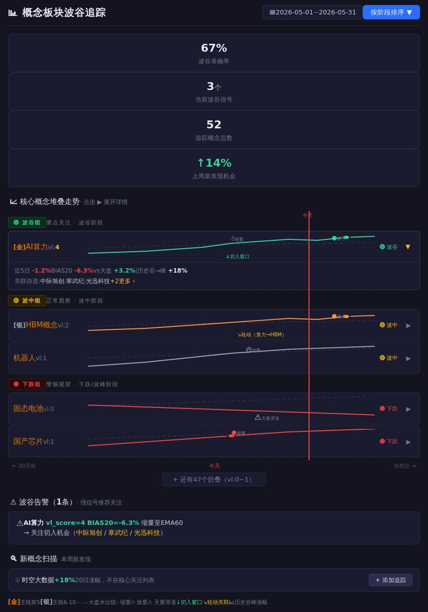

# 概念板块波谷追踪 — 设计文档 v7

## 0. 前端原型总览



*图0-1：概念板块波谷追踪页面原型。AI算力已展开详情显示近5日/BIAS20/vs大盘/历史谷峰涨幅/关联自选股（中际旭创、寒武纪、光迅科技）。其余卡片默认折叠状态。上→下：统计卡 / 🟢波谷组 / 🟡波中组 / 🔴下跌组 / ⚠️波谷告警 / 🔍新概念扫描*

> 本章之前是设计思考的全貌预览。页面为**左侧概念信息+中间30日堆叠走势+右侧阶段标签**的横向布局，每行点击▶展开近5日涨跌、BIAS20、关联自选股等详情。三个分组（波谷/波中/下跌）自上而下排列，最重要信息在最上方。

## 1. 背景与问题

### 1.1 现状

3L 体系的个股买卖点判断（L3）已经成熟，但在**板块层面**（L1/L2）的节奏判断存在断层：

```
当前系统：
  大盘波峰波谷 → V5评分 (pk_score 0~4)              ✅
  板块强弱      → 20日涨幅排名三梯队                    ✅
  板块级别波谷判断 → 不存在                            ❌
```

当前系统的波峰波谷判断只针对大盘（中证全指），不针对板块。这就漏了一个关键维度：**每个板块自己也有波峰波谷周期。**

当大盘整体转向波谷时，有些板块还在高位，有些已经跌无可跌。真正的轮动机会不在"大盘哪天见底"，而在"哪个板块先见底"。

### 1.2 痛点

L2 的"排名序"只能回答"哪个板块在涨"，回答不了"这个板块现在处于什么阶段"。板块排名第1和第50之间差了49个位置，但不知道第1名是刚启动、涨了20天、还是到了波峰要回落——这三个完全不同的场景，在排名表里看起来都是"第1名"。

3L 体系买个股的核心前提是**在正确的板块节奏里买入**——板块从波谷回升初期是风险最低的介入时机，板块到波峰放量滞涨时再好看的个股也该谨慎。没有板块的节奏判断，L3 的买卖点就缺少了上层参照。

### 1.3 目标

填补 L1→L2 之间的节奏断层：**把板块层面的判断从「排名序」推进到「节奏序」**。不只是知道概念板块涨了跌了，而是知道它在波谷、波中、还是波峰。

## 2. 设计思想

### 2.1 为什么做这个追踪：3L 体系的板块节奏断层

3L 体系的三层判断框架中，L1（大盘）和 L2（板块）之间一直存在一个断层：

```
L1（大盘）  波峰波谷 V5 评分（pk_score 0~4）       ✅ 精细，可量化
                   ↓
L2（板块）  20 日涨幅排名三梯队（主线/次级/非主线）  ⚠️ 只有排名，没有节奏
                   ↓
L3（个股）  波段 + 趋势买点判断                       ✅ 成熟，可操作
```

**核心理念：** 每个板块有自己的波谷位置。找到板块级别的波谷介入机会，比只看大盘更精准。板块从高位跌到谷底的过程，可能就是新介入机会的酝酿期。

### 2.2 为什么选概念板块而非行业板块

| | 行业板块 | 概念板块 |
|:--|:---------|:---------|
| 分类依据 | 公司主营业务 | 市场共识的叙事/主题 |
| 变化速度 | 慢 | 快（随市场热点增减） |
| 与逻辑/叙事的关系 | 弱 | **强** |
| 跨板块重叠 | 低（一只股票一个行业） | 高（一只股票属于多个概念） |

概念板块的涨跌直接反映市场对这个**叙事（逻辑）**的态度。3L 体系的 L2 就是要追踪逻辑。行业板块太稳定，不能反映市场热点的变化；概念板块随市场叙事增减，直接对应"当前市场在交易什么故事"。

### 2.3 排序方式决定看什么

按**当前阶段**把概念分成三组，而非字母序或涨跌幅序：

```
[ 波谷组 ]   → 重点关注，机会区
[ 波中组 ]   → 正常观察，区分强弱
[ 下跌组 ]   → 警惕观望，暂不介入
```

**核心理念：** 波谷扎堆=机会区（整个市场在孕育新方向），波峰扎堆=风险区（共识转向需要警惕）。

### 2.4 大盘走势作为"水位线"

每个概念走势条上叠加一条浅色虚线=中证全指同期走势。

**核心理念：** 概念走势在大盘线上方=相对市场强势（3L L1 主线特征）；在大盘线下方=相对弱势。大盘上涨背景下涨幅不一定代表强，大盘下跌中横盘才是真强。

### 2.5 量价信号标注

| 信号 | 含义 | 位置 | 判断 |
|:----|:-----|:-----|:-----|
| 💧缩量 | 回调中供应枯竭 | 波谷附近 | 可能见底→波谷有机会 |
| 🔥放量 | 上涨中需求强劲 | 波中/上升段 | 趋势健康 |
| ⚠️天量滞涨 | 上涨到高位供应出现 | 波峰附近 | 警惕见顶 |

**核心理念：** 波谷位置本身不够，需要确认「是真的底还是半山腰」。缩量到极致后的小阳线才是入场信号。

### 2.6 辅助设计原则

**主线级别染色：** 主线前5名概念加【金】竖条，6-10名加【银】竖条。
**切入窗口：** vl_score≥3+BIAS20在-5%~-8%+持续缩量时，自动标注绿色「切入窗口」。
**轮动关联：** 两个概念有前后脚涨跌规律时，用虚线箭头标注轮动链条。
**历史空间参考：** 波谷位置标注"上次谷→峰+X%"量化空间。
**可折叠详情：** 默认显示走势图和阶段标签，点击▶展开近5日/BIAS20/关联股等详情。

### 2.7 不做列表，做堆叠走势

表格看的是"谁涨了、谁跌了"的当前快照。堆叠走势看的是"这些概念过去30天是怎么走到今天的"这个时间序列。后者能看到节奏差异、先后顺序、不同阶段的长度。

三条规则：
| 规则 | 原因 |
|:----|:-----|
| 每个概念一条独立水平条 | 多线叠加太乱，看不到细节 |
| 竖线对齐今天 | 一眼对比所有概念当前的横截面位 |
| 按阶段分组上下堆叠 | 最重要（波谷）在最上面，先看 |

### 2.8 三层筛选

399个概念板块全部追踪不现实。三层筛选：

```
第一层（核心池50~80个）：自选股涉及的概念板块 → 每天拉K线，计算波谷位置
第二层（扫描池）：全市场概念板块20日涨幅排名 → 发现异常新概念，推送微信
第三层（剔除）：白酒/地产/银行等与交易风格无关的 → 不追踪
```

**核心理念：** 信息密度比信息数量重要。把精力集中在自选股辐射的概念方向上，比扫全量399个概念的噪声更有价值。

## 3. 数据模型

### 3.1 核心数据结构

#### SQLite: `track/concept_wave.db`

```sql
-- 概念板块基础信息
CREATE TABLE concepts (
    code        TEXT PRIMARY KEY,   -- 'BK1682'
    name        TEXT NOT NULL,       -- 'AI算力'
    stock_count INTEGER,            -- 成分股数量
    updated_at  TEXT
);

-- 用户追踪的概念板块
CREATE TABLE tracked_concepts (
    code        TEXT PRIMARY KEY,
    name        TEXT,
    source      TEXT,    -- 'from_watchlist' / 'manual' / 'scan_hot'
    added_at    TEXT,
    is_active   INTEGER DEFAULT 1
);

-- 概念板块每日波谷追踪记录
CREATE TABLE concept_wave (
    id          INTEGER PRIMARY KEY AUTOINCREMENT,
    code        TEXT NOT NULL,
    date        TEXT NOT NULL,
    close       REAL,
    change_pct  REAL,
    ema5/10/20/60 REAL,
    volume_ratio REAL,              -- 量比
    bias5/10/20  REAL,              -- 乖离率
    pk_score    INTEGER DEFAULT 0,  -- 偏波峰评分
    vl_score    INTEGER DEFAULT 0,  -- 偏波谷评分
    stage       TEXT,               -- '波谷'/'波中'/'波峰'/'下跌'/'上升'
    is_wave_bottom INTEGER DEFAULT 0,
    last_peak_date TEXT,
    last_trough_date TEXT,
    UNIQUE(code, date)
);

-- 追踪建议
CREATE TABLE wave_alerts (
    id          INTEGER PRIMARY KEY AUTOINCREMENT,
    code        TEXT NOT NULL,
    date        TEXT,
    wave_type   TEXT,    -- 'valley'/'peak'
    confidence  INTEGER,
    reason      TEXT,
    notified    INTEGER DEFAULT 0
);
```

#### JSON 文件

```
raw/concepts/concept_daily.json    — 概念板块K线（每日增量更新）
map/stock_concept.json             — 个股→概念映射（全量覆盖）
map/concept_list.json              — 概念板块列表+成分股
```

### 3.2 数据流

```
cron 17:00 update_stock_data.py
  ├── update_concept_maps()     → map/stock_concept.json, map/concept_list.json
  └── update_concept_klines()   → raw/concepts/concept_daily.json

页面首次加载
  ├── 从 track/concept_wave.db 读取
  ├── 计算波谷阶段(vl_score)
  ├── 缓存当天结果
  └── 推送强信号到微信

用户手动
  ├── POST /api/concept-wave/refresh → 强制重新计算
  └── POST /api/concept-wave/add     → 手动添加追踪概念
```

## 4. 系统设计

### 4.1 架构总览

```
┌──────────────────────────────┐
│  前端页面（折叠卡片+堆叠走势） │
├──────────────────────────────┤
│  API 路由                    │
│  /api/concept-wave/*         │
├──────────────────────────────┤
│  波谷服务层                   │
│  concept_wave_service.py     │
├──────────┬───────────────────┤
│ SQLite   │ JSON 文件         │
│ track/   │ raw/ + map/       │
└──────────┴───────────────────┘
```

### 4.2 核心算法：概念板块波谷评分

参照大盘 V5 评分法，适配到概念板块级别：

```
条件1: BIAS20 < -5%              → 价格远离EMA20，可能波谷
条件2: 量比 < 0.7                → 连续下跌后成交量萎缩，供应枯竭
条件3: EMA10斜率从负转平或转正   → 趋势可能见底
条件4: 近N日跌幅达该板块2σ水平   → 极端价格

输出: vl_score (0~4)
  vl_score >= 3 → 偏波谷信号，提示关注
  vl_score >= 4 → 强波谷信号，建议检查切入

与大盘的关系：
  - 大盘偏波谷时 → 所有板块波谷置信度加权 +0.5
  - 大盘偏波峰时 → 弱势板块波谷信号加权 -0.5
  - 板块独立走强 → 轮动启动迹象，加权 +1.0
```

### 4.3 API 设计

通用约定：
- 所有响应 JSON 使用 `ensure_ascii=False`，中文字段名直接返回
- 成功响应包裹 `{"success": true, ...}`
- 错误响应 `{"success": false, "error": "描述信息"}`
- GET 参数通过 query string 传入
- POST 参数通过 JSON body 传入（`Content-Type: application/json`）

---

#### `GET /api/concept-wave` — 获取追踪概念波谷数据（首页主数据）

**用途：** 前端页面首次加载，获取所有追踪概念的波谷评分、分组、告警、新概念扫描

**Query 参数：**

| 参数 | 类型 | 必填 | 默认 | 说明 |
|:-----|:----|:-----|:-----|:-----|
| `sort_by` | string | 否 | `vl_score` | 排序字段：`vl_score`(波谷评分降序) / `name`(名称) / `change_5d`(近5日涨跌) |
| `group_by` | string | 否 | `stage` | 分组方式：`stage`(按阶段) / `none`(不分组按序) |
| `date` | string | 否 | 今天 | 指定日期 `YYYY-MM-DD`（用于回溯历史快照） |

**响应 JSON Schema：**

```jsonc
{
  // 通用字段
  "success": true,                         // boolean
  "date": "2026-05-31",                    // string, 数据日期
  "data_timestamp": "2026-05-31 17:05:00", // string, 数据上次更新时间

  // 统计摘要
  "stats": {
    "total": 32,        // int, 追踪概念总数
    "valley": 5,        // int, 波谷阶段数 (vl_score>=3)
    "mid": 18,          // int, 波中阶段数 (vl_score 1~2)
    "declining": 9,     // int, 下跌阶段数 (vl_score=0, 持续新低)
    "alerts_count": 3,  // int, 强信号告警数 (vl_score>=3)
    "new_this_week": 2  // int, 本周新发现概念数
  },

  // 分组后的追踪概念列表（group_by=stage 时使用）
  "grouped": {
    "valley": [          // 波谷组 — 重点关注
      { /* ConceptItem, 见下方 */ }
    ],
    "mid": [],           // 波中组
    "declining": []      // 下跌组
  },

  // 不分组列表（group_by=none 时使用）
  "list": [],

  // 强信号告警
  "alerts": [
    {
      "code": "BK1682",           // string, 板块代码
      "name": "AI算力",            // string, 板块名称
      "vl_score": 4,              // int, 波谷置信度评分
      "reason": "BIAS20=-6.3%, 量比0.5, EMA10转平",  // string, 信号触发理由
      "date": "2026-05-31"        // string, 信号日期
    }
  ],

  // 新概念扫描结果（全市场发现的异常活跃概念）
  "new_hot": [
    {
      "code": "BK1999",           // string, 板块代码
      "name": "新型工业化",         // string, 板块名称
      "gain_20d": 18.5,           // float, 20日涨幅(%)
      "stock_count": 25,          // int, 成分股数量
      "source": "scan"            // string, 来源: "scan" / "manual"
    }
  ]
}
```

**ConceptItem 对象结构（grouped/list 中的元素）：**

```jsonc
{
  "code": "BK1682",                // string, 板块代码
  "name": "AI算力",                // string, 板块名称
  "stage": "波谷",                  // string, 阶段: "波谷" / "波中" / "下跌" / "上升" / "波峰"
  "vl_score": 4,                   // int (0~4), 波谷置信度
  "pk_score": 0,                   // int (0~4), 波峰置信度（与vl_score互斥）
  "bias20": -6.3,                  // float, 乖离率BIAS20(%)
  "change_5d": -1.2,               // float, 近5日涨跌幅(%)
  "change_1d": -0.5,               // float, 当日涨跌幅(%)
  "volume_ratio": 0.52,            // float, 当日量比 (实际量/5日均量)

  // 主线染色
  "mainline_rank": 3,              // int|null, 20日涨幅排名（null=不在前20）
  "mainline_badge": "gold",        // string|null, 徽章: "gold"(前5) / "silver"(6~10) / null

  // 量价信号
  "volume_signal": "shrink",       // string|null, 量价信号: "shrink"(缩量) / "surge"(放量) / "overheat"(天量滞涨) / null

  // 切入窗口
  "entry_window": true,            // boolean, true=当前处于切入窗口（vl_score>=3 + BIAS20<-5% + 持续缩量）

  // 与大盘对比
  "vs_market_5d": 3.2,            // float, 相对大盘近5日超额收益(%)
  "vs_market_20d": -2.1,          // float, 相对大盘近20日超额收益(%)

  // 历史参考
  "historical_gain": 18.5,         // float|null, 上次谷→峰涨幅(%)，null=无完整周期
  "last_peak_date": "2026-05-15",  // string|null, 上个波峰日期
  "last_trough_date": "2026-05-30",// string|null, 上个波谷日期
  "cycle_days": 23,                // int|null, 上次完整周期天数（峰→谷→峰或谷→峰→谷）
  "cycle_count": 2,                // int, 历史完整周期次数

  // 关联自选股
  "related_stocks": ["中际旭创", "寒武纪", "光迅科技"],  // string[], 关联的自选股名称
  "related_count": 3,              // int, 关联自选股数量
  "related_codes": ["000308", "688256", "002281"],  // string[], 关联自选股代码
  "stock_count": 35,               // int, 板块成分股总数

  // 走势图数据（30日归一化序列，用于SVG渲染）
  "wave_data": [
    {"date": "2026-05-01", "normalized": 80.5, "change_pct": 1.2, "volume_ratio": 1.05},
    {"date": "2026-05-02", "normalized": 81.2, "change_pct": 0.8, "volume_ratio": 0.95}
    // ... 30个条目
  ],

  // 关键点标注（波谷/波峰/切入窗口）
  "annotations": [
    {"date": "2026-05-10", "type": "valley", "score": 3, "label": "●波谷"},
    {"date": "2026-05-20", "type": "entry", "score": 4, "label": "↓切入窗口"}
  ]
}
```

**完整示例响应：**
```json
{
  "success": true,
  "date": "2026-05-31",
  "data_timestamp": "2026-05-31 17:05:00",
  "stats": {
    "total": 32,
    "valley": 5,
    "mid": 18,
    "declining": 9,
    "alerts_count": 3,
    "new_this_week": 2
  },
  "grouped": {
    "valley": [
      {
        "code": "BK1682",
        "name": "AI算力",
        "stage": "波谷",
        "vl_score": 4,
        "pk_score": 0,
        "bias20": -6.3,
        "change_5d": -1.2,
        "volume_ratio": 0.52,
        "mainline_rank": 3,
        "mainline_badge": "gold",
        "volume_signal": "shrink",
        "entry_window": true,
        "vs_market_5d": 3.2,
        "vs_market_20d": -2.1,
        "historical_gain": 18.5,
        "last_peak_date": "2026-05-15",
        "last_trough_date": "2026-05-28",
        "cycle_days": 23,
        "cycle_count": 2,
        "related_stocks": ["中际旭创", "寒武纪", "光迅科技"],
        "related_count": 3,
        "stock_count": 35
      }
    ],
    "mid": [],
    "declining": []
  },
  "alerts": [
    {
      "code": "BK1682",
      "name": "AI算力",
      "vl_score": 4,
      "reason": "BIAS20=-6.3%, 量比0.52, EMA10斜率转平",
      "date": "2026-05-31"
    }
  ],
  "new_hot": [
    {
      "code": "BK1999",
      "name": "新型工业化",
      "gain_20d": 18.5,
      "stock_count": 25,
      "source": "scan"
    }
  ]
}
```

---

#### `GET /api/concept-wave/detail` — 单个概念板块详情

**用途：** 点击概念行展开详情或打开独立详情页，查看完整K线数据、历史波谷波峰

**Query 参数：**

| 参数 | 类型 | 必填 | 默认 | 说明 |
|:-----|:----|:-----|:-----|:-----|
| `code` | string | 是 | — | 概念板块代码，如 `BK1682` |
| `days` | int | 否 | `60` | 返回K线天数 |
| `include_stocks` | bool | 否 | `false` | 是否同时返回成分股代码 |

**响应 JSON Schema：**

```jsonc
{
  "success": true,

  // 概念基本信息
  "concept": {
    "code": "BK1682",              // string, 板块代码
    "name": "AI算力",              // string, 板块名称
    "stock_count": 35              // int, 成分股数量
  },

  // 当前阶段
  "current_stage": {
    "stage": "波谷",               // string, 阶段
    "vl_score": 4,                // int (0~4)
    "pk_score": 0,                // int (0~4)
    "bias20": -6.3,               // float
    "bias10": -3.8,               // float
    "bias5": -1.2,                // float
    "ema5": 2750.5,               // float
    "ema10": 2720.3,              // float
    "ema20": 2680.1,              // float
    "ema60": 2600.0               // float
  },

  // K线数据数组（用于前端SVG走势图）
  "klines": [
    {
      "date": "2026-05-01",       // string, 日期
      "open": 2800,               // float, 开盘价
      "close": 2815,              // float, 收盘价
      "high": 2830,              // float, 最高价
      "low": 2790,               // float, 最低价
      "change_pct": 1.2,          // float, 涨跌幅(%)
      "volume_ratio": 1.05,       // float, 量比 (当日量/5日均量)
      "amount": 12.5,             // float, 成交额(亿)
      "ema5": 2770,              // float
      "ema10": 2740,             // float
      "ema20": 2700              // float
    }
    // ... days 个条目
  ],

  // 历史波谷波峰标注
  "wave_history": [
    {
      "date": "2026-04-15",       // string
      "type": "peak",             // string: "peak"(波峰) / "valley"(波谷)
      "score": 4,                 // int (0~4), 置信度
      "price": 2950,             // float, 当时价格
      "label": "波峰"              // string, 中文标签
    }
  ],

  // 切入窗口标注
  "entry_windows": [
    {
      "start_date": "2026-05-28",   // string
      "end_date": "2026-06-02",     // string (null=窗口未关闭)
      "max_vl_score": 4,           // int
      "reason": "BIAS20=-6.3%, 缩量3日, 大盘偏波谷"  // string
    }
  ],

  // 成分股（可选，include_stocks=true 时返回）
  "stocks": ["600111", "688256", "300308", "002281"]
}
```

---

#### `POST /api/concept-wave/add` — 添加追踪概念

**用途：** 从新概念扫描区点击「+添加追踪」按钮时调用；或手动添加

**Request Body（JSON）：**

```jsonc
{
  "code": "BK1999",        // string, 必填, 板块代码
  "name": "新型工业化",     // string, 推荐填, 板块名称（不填后端自动补全）
  "source": "scan"         // string, 选填, 来源: "scan"(扫描发现) / "manual"(手动) / "watchlist"(自选股自动关联)
}
```

**响应：**

```jsonc
// 成功
{
  "success": true,
  "message": "已添加追踪：新型工业化 (BK1999)"
}

// 失败（已存在）
{
  "success": false,
  "error": "概念板块已在追踪列表中"
}

// 失败（代码不存在）
{
  "success": false,
  "error": "未找到概念板块代码 BK9999"
}
```

---

#### `POST /api/concept-wave/remove` — 移除追踪概念

**用途：** 从追踪列表删除概念

**Request Body（JSON）：**

```jsonc
{
  "code": "BK1999"     // string, 必填, 板块代码
}
```

**响应：**

```jsonc
{
  "success": true,
  "message": "已移除追踪：新型工业化"
}
```

---

#### `POST /api/concept-wave/refresh` — 强制重新计算

**用途：** 手动触发波谷评分重新计算（通常由cron自动执行，用户可按需调用）

**Request Body：** 无（空 JSON `{}`）

**响应：**

```jsonc
{
  "success": true,
  "message": "波谷评分计算完成",
  "stats": {
    "total": 32,
    "computed": 32,
    "alerts_generated": 3,
    "duration_ms": 2450
  }
}
```

---

#### `GET /api/concept-wave/settings` — 获取追踪配置

**用途：** 返回当前用户的追踪设置（哪些概念在追踪、自选股自动关联配置等）

**响应：**

```jsonc
{
  "success": true,
  "tracked": [
    {"code": "BK1682", "name": "AI算力", "source": "watchlist", "added_at": "2026-05-25"},
    {"code": "BK1999", "name": "新型工业化", "source": "scan", "added_at": "2026-05-30"}
  ],
  "auto_add_from_watchlist": true,  // boolean, 是否自动添加自选股涉及的概念
  "excluded": ["BK0737", "BK0477"]  // string[], 用户手动排除的概念代码
}
```

---

#### `POST /api/concept-wave/settings/update` — 更新追踪配置

**用途：** 修改追踪设置（开关自动添加、排除列表）

**Request Body（JSON）：**

```jsonc
{
  "auto_add_from_watchlist": true,   // boolean, 选填
  "excluded": ["BK0737", "BK0477"]   // string[], 选填（全量替换排除列表）
}
```

**响应：**

```jsonc
{
  "success": true,
  "message": "设置已更新"
}
```


### 4.4 前端设计

#### 页面结构

页面路径：`/concept-wave.html`（新独立页面）

从上到下布局：
1. **标题栏**：📊 概念板块波谷追踪 + 日期筛选 + 按阶段排序按钮
2. **统计卡**：波谷准确率 / 当前信号数 / 追踪总数 / 上周新发现
3. **堆叠走势图**：按阶段分组（波谷/波中/下跌），每行走势+标注
4. **波谷告警**：vl_score≥3的强信号汇总
5. **新概念扫描**：全市场发现的异常概念（含添加追踪按钮）
6. **图例**：所有标注说明

#### 交互设计（折叠卡片）

每张卡片 = 一个概念板块：

```
默认收起：
┌─────────────────────────────────────────────────────────┐
│ [金]AI算力 vl:4  ━━━━━━━━━━📈━━━━━━━━━  🟢波谷  ▶     │
│                   💧缩量  ●波谷  ↓切入窗口              │
└─────────────────────────────────────────────────────────┘

点击 ▶ 展开：
┌─────────────────────────────────────────────────────────┐
│ ...                                          🟢波谷  ▼│
├─────────────────────────────────────────────────────────┤
│ 近5日 -1.2%  BIAS20 -6.3%  vs大盘 +3.2%  历史+18%      │
│ 关联自选: 中际旭创 / 寒武纪 / 光迅科技  +2更多 ›       │
└─────────────────────────────────────────────────────────┘
```

#### 走势图要素

| 要素 | 说明 |
|:----|:------|
| **竖线对齐** | 所有概念共享同一根红色竖线标记"今天" |
| **波谷/波峰** | ●绿=波谷，●红=波峰 |
| **大盘虚线** | 每行叠加中证全指同期走势（浅色虚线） |
| **主线染色** | 左侧【金】主线前5 / 【银】主线6-10 |
| **量价信号** | 💧缩量 / 🔥放量 / ⚠️天量滞涨 |
| **切入窗口** | 绿色"↓切入窗口"标签 |
| **轮动箭头** | 虚线箭头标注概念间前后脚涨跌 |
| **历史涨幅** | "历史谷→峰 +X%"量化空间 |

#### 原型链接

[打开折叠卡片原型](https://htmlpreview.github.io/?https://raw.githubusercontent.com/ggchangan/3L/feature/concept-wave-tracking/sketches/001-data-dense/index.html)

（打开后点击▶展开详情查看完整交互）

## 5. 执行计划

执行计划已拆分为独立文件，含任务状态追踪、实际耗时、阻塞项等动态信息：

👉 [概念板块波谷追踪 — 执行计划](concept-wave-tracking-plan.md)

设计文档不再维护执行进度，所有状态更新请操作上述文件。

## 6. 附录

### 6.1 不做（v1 范围外）

| 项目 | 原因 |
|:----|:-----|
| 概念板块内部轮动分析 | 复杂度高，v2 再考虑 |
| 概念板块热度排行可视化 | 表格足够，v2 再加图 |
| 自动建仓建议 | 仅做信号提示，不做自动决策 |
| 全量 486 个概念 K 线实时同步 | 只拉用户相关概念 |
| 行业板块波谷追踪同步改造 | 概念板块先做，稳定后再扩展 |

### 6.2 文件清单

```
新增:
  docs/concept-wave-tracking-design.md           — 本设计文档
  server/backend/services/concept_wave_service.py — 概念波谷追踪服务
  server/backend/api/concept_wave.py              — API 路由
  server/backend/tests/test_concept_wave.py       — 测试
  server/frontend/src/pages/ConceptWaveTracking.tsx — 前端页面
  server/frontend/src/pages/ConceptWaveTracking.css — 样式

修改:
  server/backend/core/update_stock_data.py        — 新增概念板块数据更新
  server/backend/core/data_layer.py               — 新增概念板块读取函数
  server/server.py                                — 注册路由

数据:
  data/3l/map/stock_concept.json                  — 个股→概念映射
  data/3l/map/concept_list.json                   — 概念板块列表
  data/3l/raw/concepts/concept_daily.json         — 概念板块K线
  data/3l/track/concept_wave.db                   — 波谷追踪SQLite

原型:
  sketches/001-data-dense/index.html              — 折叠卡片原型
```

### 6.3 变更日志

| 版本 | 日期 | 变更内容 |
|:----|:----|:--------|
| v1 | 初稿 | 背景/数据现状/架构重构/波谷追踪设计 |
| v2 | 补充 | 新增 Excalidraw 线框图 |
| v3 | 补充 | 新增对比折线图→改为堆叠走势图 |
| v4 | 补充 | 堆叠图+竖线+关键点标注 |
| v5 | 补充 | 3L增强特性（分组排序/大盘线/量价信号/切入窗口/轮动） |
| v6 | 本次 | 按模板重排：新增设计思想章/数据模型独立/前端原型改为折叠卡片 |
| v7 | 本次 | 新增第0章前端原型图 + 补全API设计章节（7个端点完整Schema/参数/示例值） |

### 6.4 分支策略

- 分支名：`feature/concept-wave-tracking`
- 基于 master 创建
- TDD 开发，先写测试后实现
