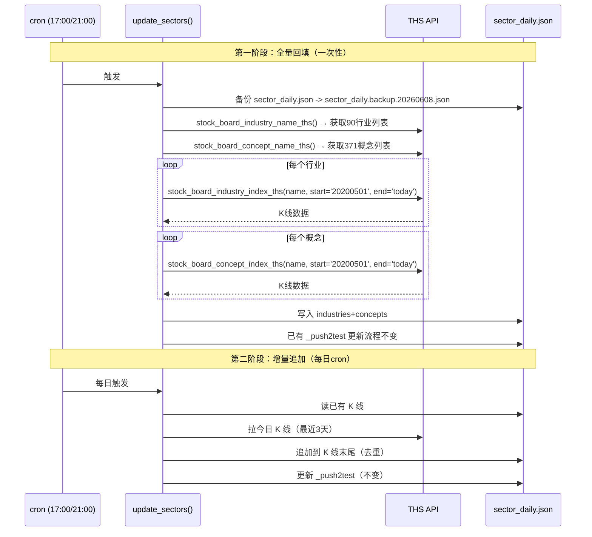

# 板块K线数据源统一 — 设计文档 v1

## 0. 前端原型总览

> 本次改动是**数据层改造**，前端页面（行业追踪/概念波谷/板块监测/主线排名）无UI变化。所有消费方继续通过统一入口 `get_sector_daily()` / `get_sector_klines()` 读取数据，前端无感知。

**核心变化：** sector_daily.json 顶层 `industries` / `concepts` 的K线数据从「零散多源→统一由同花顺THS供应」。

---

## 1. 背景与问题

### 现状

板块K线数据目前存在两套分离的数据管线：

| 数据 | 数据源 | 更新方式 | 数据量 |
|:----|:------|:---------|:------|
| **`_push2test`**（实时排行） | 同花顺THS `summary/info` API | cron每日17:00/21:00更新 | 90行业 + 80概念 |
| **`industries` / `concepts`**（历史K线） | 历史积累（早期来自东财/其他） | **几乎没有更新** | 530行业(34条完整) / 421概念(311条完整) |

### 痛点

1. **`industries` 顶层K线落后于 `_push2test` 快照** — `_push2test` 已经实时更新到当天，但 `industries` 的K线还停在旧日期（如6/4）。用户在概念波谷、主线排名、强势趋势候选页看到的K线数据是过时的。

2. **530行业中有496条(93.6%)仅1条快照** — 大量行业没有历史K线，无法计算5日/20日涨幅、BIAS、波谷评分等需要历史K线的指标。

3. **数据源不统一** — `industries` 多源（东财/其他/THS混批），与 `_push2test` 的来源THS不一致，可能出现同一板块两个数。

4. **概念K线 `data_source.py` 调用缺日期参数** — `ak.stock_board_concept_index_ths(symbol=ths_name)` 不传 `start_date`/`end_date`，返回akshare缓存的旧数据（截至2025-02-28），而非实时数据。

### 目标

**一句话：** 将 `industries` / `concepts` 的历史K线统一迁移到同花顺THS数据源，使每次 `update_sectors()` cron运行时同步追加最新K线，保证顶层K线和 `_push2test` 快照数据源一致、时效一致。

---

## 2. 设计思想

### 2.1 核心理念

**一个数据源，一次写入，统一读取。**

```
update_sectors() cron
    │
    ├── 拉取 _push2test 快照（行业summary + 概念info）—— 已有
    │
    └── 拉取 industries/concepts K线（THS指数）—— 新增
            │
            └── 写回 sector_daily.json 顶层 industries/concepts
```

- `_push2test` 仍然保留（作为实时快照，`get_sector_push2test()` 不变）
- `industries` / `concepts` 的K线改为由 THS `index_ths` API 统一供应
- 外部API通过 `get_sector_daily()` / `get_sector_klines()` 读取，无感知

### 2.2 方案选择

| 候选方案 | 优点 | 缺点 | 结论 |
|:--------|:----|:----|:----:|
| **A：全量备份→全量从THS重拉K线** | 数据100%统一；历史K线完整回填 | 行业缩小到90个（少440个）；概念缩小到371个；全量拉取慢（90行业+371概念=461次API调用，~4分钟） | ⚠️ 待确认 |
| **B：增量追加：只对新数据覆盖+原历史保留** | 旧数据保留；ROI高 | 旧K线来源仍混批；要处理回填逻辑 | ❌ 不彻底 |
| **C：备份后缩小到90行业+371概念** | 行业/概念完全同花顺对齐 | 大幅缩容会丢失东财细分分类；依赖东财细分分类的页面/逻辑可能受影响 | ⚠️ 待确认 |

**我的推荐方案是方案A**（全量THS重拉，数据缩容到THS范围），理由是：

1. 用户已确认「90个行业可以的」
2. 需要历史K线的核心功能（概念波谷、主线排名、强势趋势）只依赖同花顺范围内的板块
3. 备份机制可回滚，风险可控

### 2.3 设计原则

1. **真数据不造假** — 当天K线数据不到就不补；能拉几天算几天
2. **可回滚** — 每次修改前备份原文件
3. **后向兼容** — 所有 API 签名不变，消费者无需改动
4. **一次到位** — 先全量THS重拉，后续cron增量追加

### 2.4 屏幕内外

**这个功能做什么：**
- 备份现有 `sector_daily.json` → 全量从THS `stock_board_industry_index_ths()` / `stock_board_concept_index_ths()` 拉取所有90行业+371概念的历史K线
- 写入 `sector_daily.json` 顶层 `industries` / `concepts` 字段
- 修改 `update_sectors()` cron，每次跑完追加当天K线
- 修复 `data_source.py` 中概念K线缺日期参数的bug

**这个功能不做什么：**
- ❌ 不改 UI（前端页面无变化）
- ❌ 不改 API 路由/签名
- ❌ 不改 `_push2test` 快照管线（保持已有的 THS summary/info API）
- ❌ 不新增文件或目录结构
- ❌ 不添加新的监控/报警逻辑

### 2.5 向后兼容策略

**数据模型：**
- `sector_daily.json` 的顶级结构 `{last_updated, industries, concepts, _push2test, _push2test_updated}` 不变
- `industries` 内的板块名称从「东财名」改为「同花顺名」——导致**530→90的缩容**
- 旧行业如果不在THS范围内，将不再出现在 `industries` 中

**对消费者的影响：**

| 消费者 | 影响 | 风险 |
|:------|:----|:----:|
| 概念波谷 `/api/concept-wave` | 概念从421→371，部分概念名可能变 | ⚪ 映射表保证一致性 |
| 主线排名 `review_compute_service.py` | 行业从530→90，主线排名更聚焦 | 🟢 正向 |
| 强势趋势候选 `strong_trend_service.py` | 候选范围缩小 | 🟢 更精准 |
| 个股卡片 `stock_card_service.py` 板块5日涨跌 | 个股的 `sector` 字段（来自同花顺名）与新K线名匹配 | 🟢 一致 |
| `_push2test` 快照 | 不变 | 🟢 |
| 测试 | 需调整断言（行业>200条→行业≥90条等） | ⚪ 需改 |

**旧数据读取：** 新格式 `{th_name: [kline,...]}` 取代旧格式 `{old_name: [kline,...]}`。两者均为 `{str: list}` 格式，读取方式不变。如果旧代码通过名称查找（如 `data['industries']['半导体']`），只要THS名与旧名一致就能工作。不一致时会返回 `None`，需走映射表。

---

## 3. 数据模型

### 3.1 sector_daily.json 结构（不变）

```json
{
  "last_updated": "20260609",
  "industries": {
    "半导体": [
      {"date": "20260601", "open": 1234.5, "close": 1245.6, "high": 1250.0, "low": 1230.0, "volume": 12345678},
      ...
    ],
    "白酒": [...],
    ...
  },
  "concepts": {
    "芯片概念": [...],
    ...
  },
  "_push2test": {
    "industries": [...],
    "concepts": [...]
  },
  "_push2test_updated": "20260609"
}
```

**唯一变化：** `industries` 和 `concepts` 的 K 线数据来源统一为 THS，key 名称统一为 THS 板块名。

### 3.2 THS K线格式

`stock_board_industry_index_ths(symbol, start_date, end_date)` 返回结构：

```
date       开盘    收盘    最高    最低   成交量      成交额
2026-06-01 1234.5 1245.6 1250.0 1230.0 12345678 987654321
```

映射到内部 K 线格式：`date`, `open`, `close`, `high`, `low`, `volume`（不含 `amount`）。

### 3.3 数据流



---

## 4. 系统设计

### 4.1 架构总览

```
修改前：
update_sectors()
    ├── _push2test ← THS summary/info API ✅
    └── industries/concepts K线 ← 未更新 ❌

修改后：
update_sectors()
    ├── _push2test ← THS summary/info API (不变)
    └── industries/concepts K线 ← THS index_ths API (新增)
        ├── 首次：全量回填（所有90行业+371概念K线）
        └── 每日：增量追加（最近3天K线，去重）
```

### 4.2 核心逻辑

#### 全量回填脚本 `refresh_sectors_ths.py`

- 读取 THS 行业列表（90个）+ 概念列表（371个）
- 对每个板块调用 `index_ths(name, start_date='20200501', end_date='today')` 拉取近1年OHLC
- 并发控制：10并发/批，0.3s间隔
- 异常处理：单个板块失败跳过，不影响其他板块
- 保存：`save_sector_daily(data)` 写回

#### `update_sectors()` 增量追加修改

在现有 `update_sectors()` 函数末尾追加K线更新逻辑：

```python
def update_sectors():
    # ... 现有 _push2test 更新逻辑不变 ...

    # 新增：更新 industries/concepts K线
    for name in industries_list:
        klines = ak.stock_board_industry_index_ths(name, start_date=three_days_ago, end_date=today)
        # 去重：只追加当天新K线
        existing = data['industries'].get(name, [])
        existing_dates = {k['date'] for k in existing}
        new_klines = [k for k in klines if k['date'] not in existing_dates]
        if new_klines:
            data['industries'][name].extend(new_klines)

    # concepts 同理
```

#### 修复 `data_source.py` 概念K线日期参数

```python
# 修改前（无日期参数 → 返回缓存旧数据）：
df = ak.stock_board_concept_index_ths(symbol=ths_name)

# 修改后（带日期参数 → 返回实时数据）：
today = datetime.now().strftime('%Y%m%d')
three_months_ago = (datetime.now() - timedelta(days=90)).strftime('%Y%m%d')
df = ak.stock_board_concept_index_ths(symbol=ths_name, start_date=three_months_ago, end_date=today)
```

### 4.3 API 设计

**所有 API 签名、路由、请求/响应格式不变。**

受影响的路由（数据源变更但格式不变）：

| 路由 | 后端函数 | 数据源变化 |
|:----|:---------|:----------|
| `GET /api/concept-wave` | `concept_wave.py:judge_concept_wave()` | K线来源：THS（统一） |
| `GET /api/monitor/sectors` | `monitor_service.get_top_sectors()` | 实时排行不变；5日涨幅K线来源改为THS |
| `GET /api/industry-boards` | `market_service.get_industry_boards()` | 不变（THS summary） |
| `GET /api/sector-chart` | `market_service.get_sector_chart()` | K线来源改为THS |
| 个股卡片 `sector_chg_5d` | `stock_card_service._load_sector_daily()` | K线来源改为THS |

### 4.4 前端设计

**无变化。** 但需要验证以下前端页面在新数据下正常工作：

- [ ] 行业追踪页 `/industry.html` — 显示的行业列表从530降到90
- [ ] 概念波谷追踪 `/concept-wave` — 概念从421降到371
- [ ] 板块监测 `SectorMonitor.tsx` — 行业Tab/概念Tab
- [ ] 强势趋势候选 `StrongTrendCandidates.tsx` — `top_industries` / `hot_concepts`
- [ ] 宏观页 `Macro.tsx` — `mainline_sectors` / `emerging_sectors`

---

## 5. 执行计划

详见：[板块K线数据源统一 — 执行计划](plan.md)

---

## 6. 附录

### 6.1 影响分析摘要

全库搜索追踪 `sector_daily.json` / `get_sector_daily()` 消费者共 **44处**：

| 级别 | 数量 | 文件举例 |
|:----|:----:|:---------|
| 后端服务（直接调 `get_sector_daily()`） | 8 | `concept_wave.py`, `review_compute_service.py`, `panic_monitor_service.py`, `strong_trend_service.py` |
| 间接消费者（链式调用） | 8 | `monitor_data.py`, `monitor_service.py`, `market_service.py`, `stock_card_service.py` |
| API 路由 | 7 | `/api/concept-wave`, `/api/monitor/sectors`, `/api/industry-boards`, `/api/sector-chart` |
| 前端 API 封装 | 4 | `api.ts` (fetchSectors, fetchLeaderDashboard 等) |
| 前端组件/页面 | 14 | `SectorMonitor.tsx`, `ConceptWaveTracking.tsx`, `Industry.tsx`, `StrongTrendCandidates.tsx` |
| 测试文件 | 8 | `test_data_layer_contract.py`, `test_concept_wave.py`, `test_api.py` |

所有消费者都是**通过字段名读数据**，不依赖数据源的来源。只要 `industries[th_name]` 的K线格式不变、`concepts[th_name]` 的K线格式不变，消费者无感知。

### 6.2 THS vs 当前板块名对照

| 维度 | 当前数量 | THS数量 | 重叠度 | 影响 |
|:----|:--------:|:-------:|:------:|:----|
| 行业 | 530 | 90 | 90个THS名 → 当前全部有同名对应 | 非THS行业将被移除 |
| 概念 | 421 | 371 | THS概念+当前概念通过 `concept_list.json` / `f103` 映射 | 覆盖一致 |

### 6.3 风险与缓解

| 风险 | 概率 | 影响 | 缓解措施 |
|:----|:----:|:----:|:--------|
| THS API 偶发失败（No tables found） | 低 | 部分行业丢失K线 | 重试3次 + 单个失败不阻断全量 |
| THS行业名与现有同名字段不一致（如"银行" vs "银行I"） | 低 | K线对应不上 | 统一用 `stock_board_industry_name_ths()` 返回的标准名 |
| 全量拉取 > 5分钟触发超时 | 中 | 部分概念未拉完 | 分批执行（10并发/批）+ 断点续传 |
| 90行业缩容后，`strong_trend_service.py` 中引用旧行业名的逻辑中断 | 中 | 候选范围缩窄 | 检查所有硬编码行业名引用；优先用THS名 |

### 6.4 开放问题

- [ ] 全量回填一次性脚本是单独 `refresh_sectors_ths.py`，还是并入现有的 `refresh_sectors.py`？
- [ ] 全量回填执行时间预估~4分钟（461次API × 0.5s + 并发），是否同步执行？还是后台异步？
- [ ] `update_sectors()` 中增量追加是否会拖慢现有cron执行时间（目前~2分钟，追加后~3分钟）？

### 6.5 文件清单

**新增：**
```
server/scripts/refresh_sectors_ths.py   — 全量回填 THS K线脚本（一次性）
```

**修改：**
```
server/backend/core/update_stock_data.py  — update_sectors() 追加K线更新逻辑
server/backend/services/data_source.py    — 修复概念K线缺日期参数
server/backend/tests/                     — 调整测试断言（行业数量等）
```

### 6.6 变更日志

| 版本 | 日期 | 变更内容 |
|:----|:----|:--------|
| v1 | 2026-06-08 | 初稿 |
| v2 | 2026-06-08 | ✅ 已实现 — 全量回填脚本+增量追加逻辑+data_source日期参数修复 |
