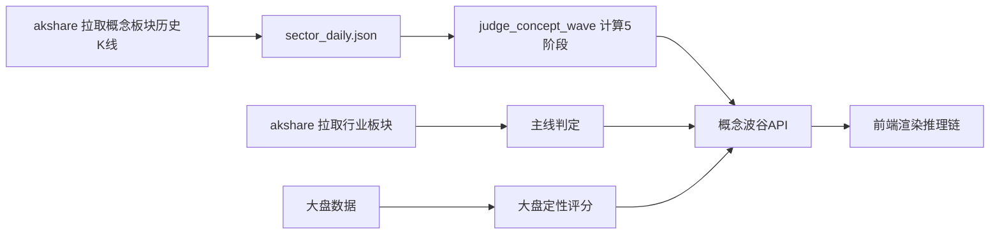

# 市场推理链路打通 — 设计文档 v1

## 0. 前端原型总览

> 📸 原型待生成（设计确认后做 HTML 原型）

核心布局：
- **概念波谷页**每张卡片展开后增加"推理链"区块
- **宏观页**大盘定性增加成交量+主线清晰度维度
- **复盘页/持仓页**个股卡片增加"来源链"（大盘→概念→个股）

## 1. 背景与问题

### 1.1 现状：三个模块各自为政

| 模块 | 页面 | 判断什么 | 输出 |
|:----|:----|:--------|:----|
| 🏛 大盘定性 | 宏观页 / MarketCycle | 大盘周期位置 | 仓位建议 + 策略 |
| 📦 概念波谷追踪 | 概念波谷页 | 概念所处阶段 | 波谷/波峰/上涨/下跌/波中 |
| 📈 个股卡片 | 复盘/持仓/盯盘 | 个股买卖信号 | buy/hold/sell |

**问题：** 这三层在系统中是独立计算的，没有任何一页能把"大盘→概念→个股"的推理链串起来。

### 1.2 痛点

1. **用户看到"概念波谷(89.9%)"，但不知道为什么它是波谷，也不知道这个信号对持仓股意味着什么**
2. **大盘定性缺少「成交量水平+主线清晰度」维度**，不完整
3. **概念波谷和主线之间没有关联显示** — 用户无法快速判断"这个波谷概念是不是潜在主线方向"
4. **目前只有60天数据**，回测样本量有限

### 1.3 目标

打通大盘定性 → 概念波谷 → 个股信号的完整推理链路，让用户在看任何一页时都能追踪"为什么"：

```
大盘周期 → 适合什么策略
   ↓
概念阶段 → 这个方向值不值得看
   ↓
个股信号 → 具体买还是卖
```

同时补全大盘定性、拉长历史数据。

## 2. 设计思想

### 2.1 核心理念：波谷是选方向，主线是确认方向

波谷追踪和主线判定不是矛盾的，而是**周期的不同阶段**：

```
波谷(超卖) → 上涨(开始涨) → 波中(趋势中) → 主线(确认最强) → 波峰(见顶)
     ↑                                                         ↓
     └──────────────── 回调 ────────────────────────────────────┘
```

- **波谷追踪**是前瞻性的，在概念还没成为主线时就发现它
- **主线判定**是确认性的，告诉你市场已经选出来的方向
- 推理链打通后，用户能直接看到："这个波谷概念关联哪个行业板块，那个板块在主线上排第几"

### 2.2 大盘定性补全

原文《大盘定性》的逻辑：

```
大盘状态 = 趋势(上升/下降/震荡) + 强弱(成交量水平 + 主线清晰度)

上升趋势 + 成交量足 + 主线清晰    → 积极持股（高仓位）
震荡     + 有量 + 主线不持续     → 谨慎参与（中等仓位）
下降趋势 + 缩量 + 无主线         → 休息控仓（低仓位）
```

当前系统只用了 V5 评分（偏峰/偏谷），没有单独判断"成交量水平"和"主线清晰度"。

### 2.3 推理链 = 大盘→概念→个股的三层可视化

在概念波谷页展开卡片的详情区，增加推理链区块：

```
📊 推理链
━━━━━━━━━━━━━━━━━━━━━━━━━
🏛 大盘周期：波中偏谷（建议仓位 5-7成）
   成交量：1.2万亿（中等水平）
   主线：元件(第3名) · 半导体(第1名) · 电子化学品(第2名)

📦 本概念：波谷(89.9%) · 关联主线行业：元件(第3名)
   vl_score=4 · BIAS20=-6.3% · 量比=0.45(极度缩量) · EMA10走平
   → 跌透缩量，底部确认

📈 关联个股买点：
   深南电路(002916) → 🟢 中继买点（缩量回踩EMA5）
   沪电股份(002463) → 🟢 突破买点（放量突破前高）
━━━━━━━━━━━━━━━━━━━━━━━━━
```

### 2.4 这个功能做什么 / 不做什么

**做什么：**
- 概念波谷页每张卡片展开后显示推理链
- 大盘定性补全成交量+主线维度
- 拉长历史数据到180天以上
- 概念与行业板块的关联显示

**不做什么：**
- 不改变现有的买点/卖点判定逻辑
- 不做新的交互方式（非本期）
- 不做全市场自动扫描

## 3. 数据模型

### 3.1 推理链数据结构

```jsonc
{
  "concept": "AI算力",
  "stage": "波谷",
  "stage_prob": "89.9%",
  "reasoning_chain": {
    "market": {
      "position": "波中偏谷",
      "position_pct": "5-7成",
      "volume_level": "中等水平",
      "volume_amount": "1.2万亿",
      "top_mainlines": [
        {"name": "半导体", "rank": 1, "days": 5},
        {"name": "电子化学品", "rank": 2, "days": 3},
        {"name": "元件", "rank": 3, "days": 8}
      ]
    },
    "concept_analysis": {
      "vl_score": 4,
      "bias20": -6.3,
      "volume_ratio": 0.45,
      "volume_signal": "shrink",
      "ema10_slope": -0.15,
      "reason": "BIAS20深度负值+极度缩量+EMA10走平 → 波谷确认"
    },
    "related_industry": {
      "name": "元件",
      "mainline_rank": 3,
      "days_on_mainline": 8
    },
    "stock_signals": [
      {
        "code": "002916",
        "name": "深南电路",
        "signal": "buy",
        "buy_type": "中继买点",
        "reason": "缩量回踩EMA5成功"
      }
    ]
  }
}
```

### 3.2 数据流



## 4. 系统设计

### 4.1 大盘定性改造

**当前**：`/api/market` 返回 `{position, pk_score, vl_score, bias20, strategy, position_pct}`

**改造后**：增加字段
```jsonc
{
  // ...原有字段
  "volume": 120000000000,          // 今日成交额
  "volume_level": "中等",          // 高/中/低
  "mainline_clarity": "清晰",       // 清晰/模糊/无
  "market_quality": {              // 综合定性
    "trend": "上升趋势",
    "strength": "强势",
    "strategy": "积极持股"
  }
}
```

### 4.2 概念波谷页 — 推理链区块

在现有卡片展开详情中增加推理链组件：

```tsx
// ConceptWaveTracking.tsx — 展开详情区新增
<div className="reasoning-chain">
  <div className="chain-header">📊 推理链</div>
  <div className="chain-market">🏛 {marketInfo}</div>
  <div className="chain-concept">📦 {conceptAnalysis}</div>
  {stockSignals.length > 0 && (
    <div className="chain-stocks">📈 {stockSignals}</div>
  )}
</div>
```

### 4.3 数据拉取改造

**当前**：`_fetch_sector_klines_akshare()` 只拉90天

**改造**：改为拉365天（1年）+ 增量更新

```python
# 改造点
start = (datetime.now() - timedelta(days=365)).strftime('%Y%m%d')
# 加增量更新：已有数据 ≥ 365天 → 只拉最近5天补全
```

## 5. 执行计划

详见：[执行计划](plan.md)

## 6. 附录

### 6.1 数据拉取可行性

2026-06-01 实测：akshare `stock_board_concept_index_ths()` 对单个概念可返回 **338行数据**（2025-01-02 → 2026-05-29，约1.5年）。当前只拉了90天。

375个概念 × 338行/概念 ≈ 126,750行K线数据，拉取时间约 375 × 5秒 ≈ 30分钟。

### 6.2 开放问题

1. 推理链API是否需要独立端点，还是合并到现有 `/api/concept-wave`？
2. 概念和行业板块的关联映射（同花顺概念→同花顺行业）是否已有？
3. 大盘"成交量水平"的阈值（高/中/低）需要确定

### 6.3 文件清单

```
新增：
  docs/market-three-layer/design.md     — 本文
  docs/market-three-layer/plan.md       — 执行计划

修改：
  server/backend/core/update_stock_data.py  — 拉长数据到365天
  server/backend/services/concept_wave_service.py  — 推理链数据
  server/backend/api/concept_wave.py      — 推理链API
  server/frontend/src/pages/ConceptWaveTracking.tsx  — 推理链UI
  server/backend/api/market.py            — 大盘定性补全
  server/frontend/src/components/MarketCycle.tsx  — 大盘定性显示
```

### 6.4 变更日志

| 版本 | 日期 | 变更内容 |
|:----|:----|:--------|
| v1 | 2026-06-01 | 初稿 — 推理链设计 + 大盘定性补全 + 数据拉长 |
