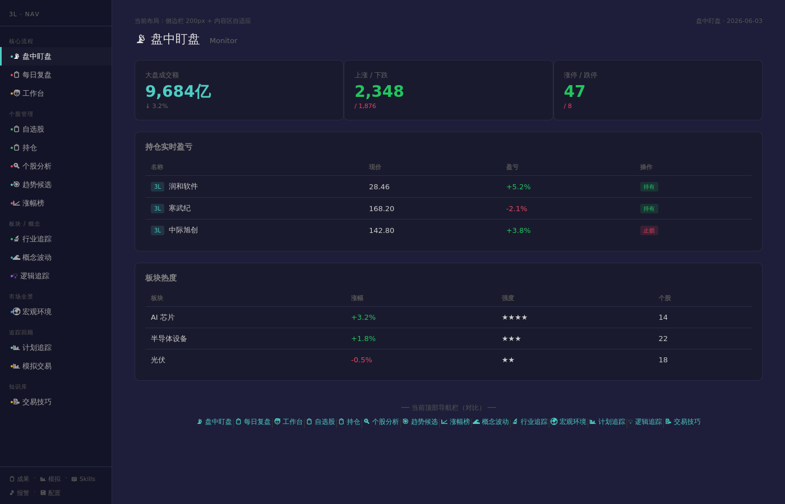

# 侧边栏导航重构 — 设计文档 v1

> **状态：** ✅ 已实现并合入 `feat/nav-optimize` 分支
> **分支：** `feat/nav-optimize`

---

## 0. 前端原型总览

> 📸 **先看图再看字。** 本章放置功能原型截图，让读者一翻开就能直观看到"这个功能做出来长什么样"。

*图0-1：侧边栏原型效果*



**核心布局一句话总结：** 顶部横向导航栏 → **左侧固定边栏 200px**，14个导航项按6组分列，底部辅助页面，主内容区布局不变。

---

## 1. 背景与问题

**现状：** 当前导航栏是顶部水平 flex-wrap 布局，14个导航项全部排在一行。

```
📡 盘中盯盘 | 📋 每日复盘 | 🧑 工作台 | 📋 自选股 | 📋 持仓 | 🔍 个股分析 | 🎯 趋势候选 | 📈 涨幅榜 | 🌊 概念波动 | 🔬 行业追踪 | 🌍 宏观环境 | 📊 计划追踪 | 💡 逻辑追踪 | 📝 交易技巧
```

**痛点：**
1. 项数过多（14项），窗口稍窄就换行，**「盘中盯盘」被挤到最左边**，用户需要鼠标滑到左上角才能点击
2. 分组不直观 — 全部平等排列，没有视觉层次区分核心流程 vs 辅助功能
3. 横向空间利用率低 — 导航项名短，横向间距占大量空间

**目标：** 将导航改为左侧固定侧边栏，按功能分组，所有项永久可见，核心操作（盘中盯盘）固定在顶部最易点击的位置。

---

## 2. 设计思想

### 2.1 核心理念

交易系统是高频使用的专业工具，导航设计应优先考虑**可达性**和**信息密度**，而非视觉简洁。侧边栏模式在 TradingView、Bloomberg Terminal 等专业交易工具中是主流布局。

### 2.2 方案选择

| 候选方案 | 优点 | 缺点 | 结论 |
|:--------|:----|:----|:----:|
| 顶部 flex-wrap（现状） | 无需改动 | 换行后核心项被推远，无分组 | ❌ |
| 顶部分组+二级展开 | 顶栏简洁 | 低频项需要多一次点击 | ❌ |
| **左侧固定边栏** | 全部可见，核心项固定顶部，专业感强，可扩展性好 | 需要改布局结构 | ✅ |
| 左侧折叠边栏（图标-only） | 更节省空间 | 用户不熟悉图标，需要额外认知成本 | ❌ |

### 2.3 设计原则

1. **核心优先：** 盘中盯盘（最高频页面）固定在侧边栏最顶部
2. **全部可见：** 所有14个导航项不需滚动/展开即可看到
3. **分组清晰：** 按使用场景分6组，组间有视觉分隔

### 2.4 屏幕内外

- **做什么：** 将 NavBar 从顶部水平栏改为左侧垂直边栏；重新组织导航分组顺序
- **不做什么：**
  - 不改变主内容区布局（仍保持居中 `max-width: 1200px; margin: 0 auto`）
  - 不改动页面路由或 API
  - 不改动 BottomNav（仍保留在页面底部做辅助导航）
  - 不引入图标-only 模式或可折叠边栏
  - 不添加新的页面或功能

---

## 3. 数据模型

无新增数据模型。导航数据从 NavBar.tsx 内的常量数组迁移为左侧边栏布局，数据结构不变。

---

## 4. 系统设计

### 4.1 架构总览

纯前端改动，只涉及一个文件：

```
server/frontend/src/components/NavBar.tsx  ← 唯一修改文件
```

页面布局从：

```
┌──────────────────────────────────────────┐
│  顶部 NavBar（14项水平 flex-wrap）        │
├──────────────────────────────────────────┤
│                  主内容区                 │
│          居中 max-width: 1200px          │
│                                           │
├──────────────────────────────────────────┤
│           底部 BottomNav                   │
└──────────────────────────────────────────┘
```

改为：

```
┌──────┬─────────────────────────────────────┐
│      │                                     │
│ 左侧 │          主内容区                    │
│ 边栏  │     居中 max-width: 1200px          │
│ 200px │                                     │
│ 固定  │                                     │
│      │                                     │
├──────┤                                     │
│ 底部  │                                     │
└──────┴─────────────────────────────────────┘
```

### 4.2 前端设计

#### 侧边栏布局

```
┌─ sidebar 200px ─────────────────────┐
│ 3L · NAV              （标题行）     │
├─────────────────────────────────────┤
│ 核心流程               （组标签）     │
│ ● 📡 盘中盯盘          （高亮/选中）   │
│ ● 📋 每日复盘                        │
│ ● 🧑 工作台                         │
│ ──                                   │
│ 个股管理               （组标签）     │
│ ● 📋 自选股                         │
│ ● 📋 持仓                           │
│ ● 🔍 个股分析                       │
│ ● 🎯 趋势候选                       │
│ ● 📈 涨幅榜                         │
│ ──                                   │
│ 板块 / 概念            （组标签）     │
│ ● 🔬 行业追踪                       │
│ ● 🌊 概念波动                       │
│ ● 💡 逻辑追踪                       │
│ ──                                   │
│ 市场全景               （组标签）     │
│ ● 🌍 宏观环境                       │
│ ──                                   │
│ 追踪回顾               （组标签）     │
│ ● 📊 计划追踪                       │
│ ● 📊 模拟交易                       │
│ ──                                   │
│ 知识库                 （组标签）     │
│ ● 📝 交易技巧                       │
├─────────────────────────────────────┤
│ 成果 · 模拟 · Skills · 报警（底部）  │
└─────────────────────────────────────┘
```

#### 视觉样式

| 元素 | 样式 |
|:----|:-----|
| 侧边栏背景 | `#141428`（比主背景 `#1a1a2e` 更深） |
| 宽度 | 200px，固定，sticky top:0 |
| 边栏高亮（当前页） | 左侧 3px 彩色边框（复用现有 TOP_COLORS）+ 微亮背景 |
| 项间距 | 8px padding（上下），16px（左右） |
| 字号 | 13px，组标签 10px 灰字 |
| 分隔 | 组间 14px 上边距，无分割线（只靠间距区分） |
| 底部 | 11px 灰字，水平排列，· 分隔 |

#### 分组与颜色对应

| 分组 | 颜色 | 对应页面 |
|:----|:----|:---------|
| 核心流程 | `#4ecdc4` (青) / `#e94560` (红) / `#f59e0b` (橙) | 盯盘/复盘/工作 |
| 个股管理 | `#22c55e` (绿) / `#e94560` (红) / `#4ecdc4` (青) | 自选/持仓/分析/趋势/涨幅 |
| 板块/概念 | `#22c55e` / `#00bcd4` / `#a855f7` (紫) | 行业/概念/逻辑 |
| 市场全景 | `#2196f3` (蓝) | 宏观 |
| 追踪回顾 | `#4ecdc4` / `#f59e0b` | 计划/模拟 |
| 知识库 | `#f59e0b` | 技巧 |

#### 页面迁移（同时进行的调整）

1. **Holdings 页面** — 从 private 目录移出，标题去掉"私密" ✅（已在分支中完成）
2. **登录认证** — 去除后端 PROTECTED_PREFIX 和 AUTH_USER/AUTH_PASS 检查 ✅（已在分支中完成）
3. **导航项** — 持仓和涨幅榜加入个股管理组 ✅（已在分支中完成）

---

## 5. 执行计划

详见：[侧边栏导航重构 — 执行计划](plan.md)

---

## 6. 附录

### 6.1 替代方案

1. **分组+二级展开：** 优点是可保持顶部导航，缺点是低频页面需多次点击。放弃理由 — 用户希望全部可见。
2. **左侧图标-only 边栏：** 更紧凑但需要学习成本，不符合效率优先原则。

### 6.2 开放问题

无

### 6.3 文件清单

```
新增：
  docs/sidebar-nav/design.md        — 本设计文档
  docs/sidebar-nav/plan.md          — 执行计划
  docs/sidebar-nav/prototype.jpg    — 原型截图
修改：
  server/frontend/src/components/NavBar.tsx  — 重写为侧边栏布局
  server/frontend/src/__tests__/navbar.test.tsx  — 更新测试（如果存在）
```

### 6.4 变更日志

| 版本 | 日期 | 变更内容 |
|:----|:----|:--------|
| v1 | 2026-06-03 | 初稿 — 侧边栏方案确认 |
